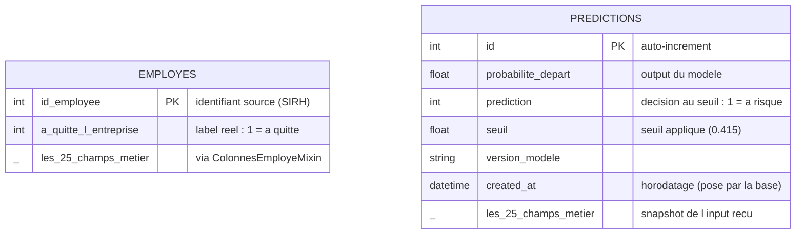

# Modèle de données — base `attrition` (PostgreSQL)

Deux tables, déclarées dans [app/orm.py](../app/orm.py) via SQLAlchemy. Les **25 champs métier**
(l'input du modèle) sont déclarés une seule fois dans un **mixin** (`ColonnesEmployeMixin`) hérité
par les deux tables : leur alignement est garanti par construction (et vérifié par un test).

## Vue d'ensemble



> Pas de clé étrangère entre `predictions` et `employes` : la table `predictions` porte un
> **snapshot** de l'input reçu, car l'API doit pouvoir tracer un employé **absent du dataset**
> (nouveau salarié, donnée modifiée). Le dataset est la *référence* ; la trace est la *réalité reçue*.

## Les 25 champs métier (mixin, communs aux deux tables)

| Source | Champs |
|---|---|
| SIRH | `age`, `genre`, `revenu_mensuel`, `statut_marital`, `departement`, `poste`, `nombre_experiences_precedentes`, `annee_experience_totale`, `annees_dans_l_entreprise`, `annees_dans_le_poste_actuel` |
| EVAL | `satisfaction_employee_environnement`, `note_evaluation_precedente`, `satisfaction_employee_nature_travail`, `satisfaction_employee_equipe`, `satisfaction_employee_equilibre_pro_perso`, `heure_supplementaires`, `augementation_salaire_precedente` |
| SONDAGE | `nombre_participation_pee`, `nb_formations_suivies`, `distance_domicile_travail`, `niveau_education`, `domaine_etude`, `frequence_deplacement`, `annees_depuis_la_derniere_promotion`, `annes_sous_responsable_actuel` |

## Rôle de chaque table

- **`employes`** — le dataset complet de la mission 3 (1470 lignes, jointure des 3 CSV) + le label
  réel. Inséré par `scripts/load_dataset.py` (idempotent, upsert par PK). C'est la donnée de
  référence : exemples d'entrées/sorties exigés par le brief, et base d'un futur réentraînement.
- **`predictions`** — la **mémoire de l'activité du modèle** : chaque appel à `/predict` ou
  `/predict/batch` y écrit l'input reçu, l'output rendu, le seuil et la version du modèle,
  horodatés. Sert l'audit (« pourquoi ce salarié a-t-il été signalé ? »), le suivi de dérive
  (comparer les inputs de prod au train) et la relecture via `GET /predictions`.

## Cycle de vie

```
docker compose up -d                    # Postgres local (dev)
uv run python -m scripts.create_db      # crée les tables (idempotent)
uv run python -m scripts.load_dataset   # insère les 1470 employés
uv run uvicorn app.main:app --reload    # l'API trace chaque prédiction
```

En production : Postgres managé (Neon/Supabase), URL injectée par le secret `DATABASE_URL`.
En CI : Postgres éphémère (service GitHub Actions), les tests DB/API tournent contre un vrai
Postgres ; en local sans Docker, ils retombent sur SQLite en mémoire (même ORM).
